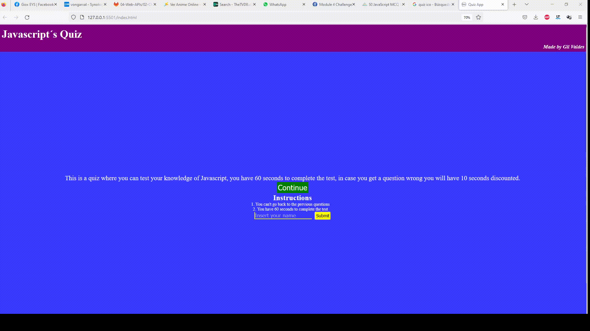

This is a project quiz app.
In these application the user will be shown with random questions about the programming languaje javascript

In the previous image you can see how the page works.
You start in the home page where you can press the continue button in order to take you to the quiz.
Then you answer the questions till you finish them all or the time is finish and then go back to the home page in order to log your name and score.
For the quiz functionality I use the content of this video:
https://youtu.be/riDzcEQbX6k